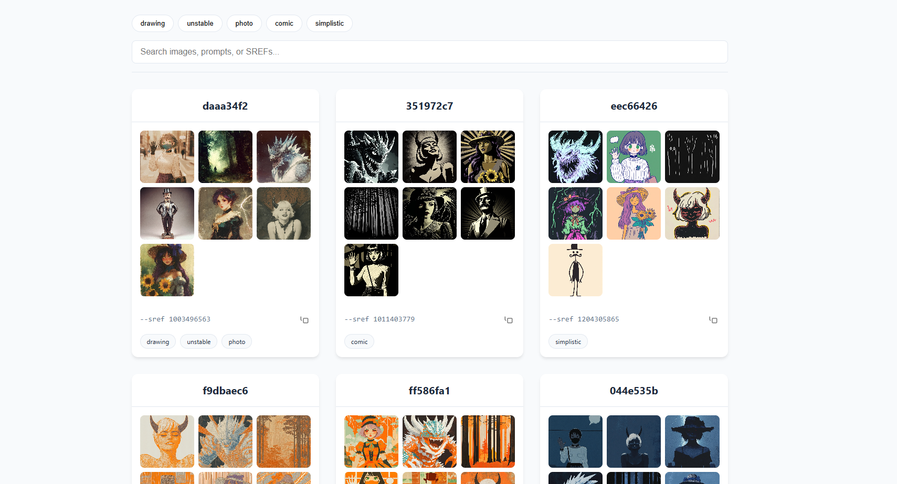
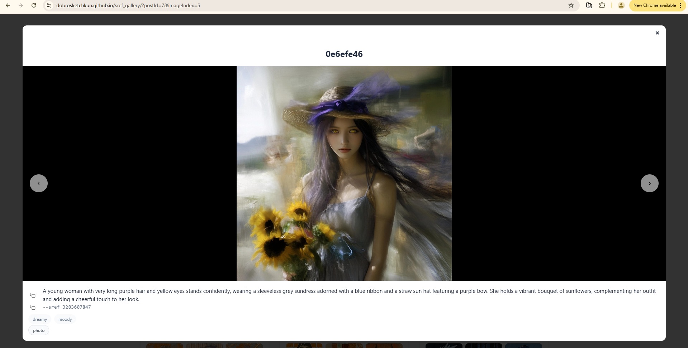
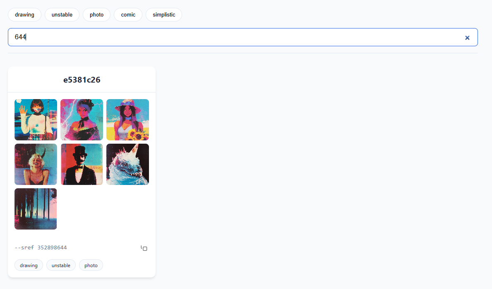
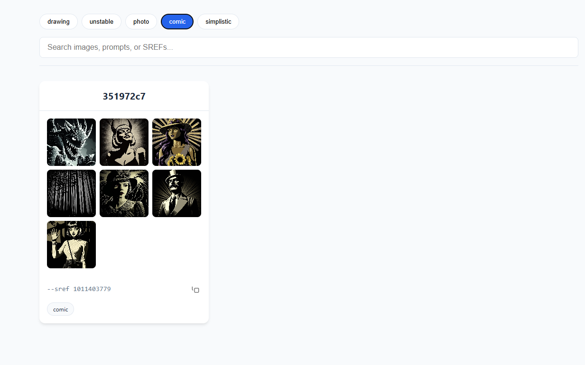
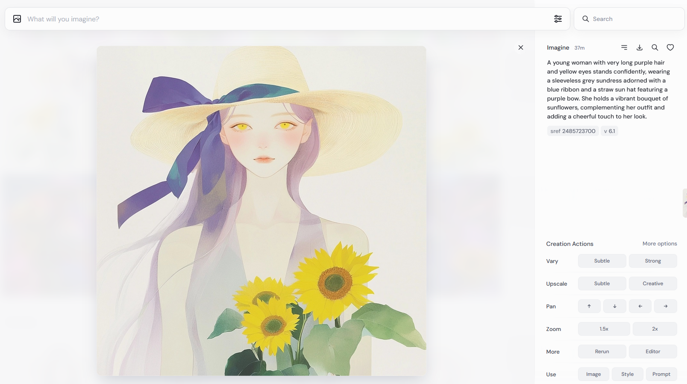
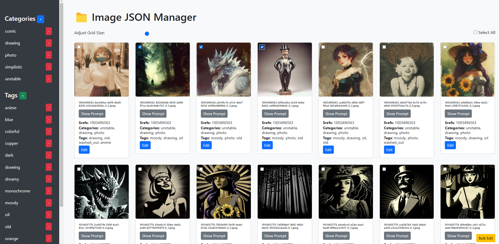
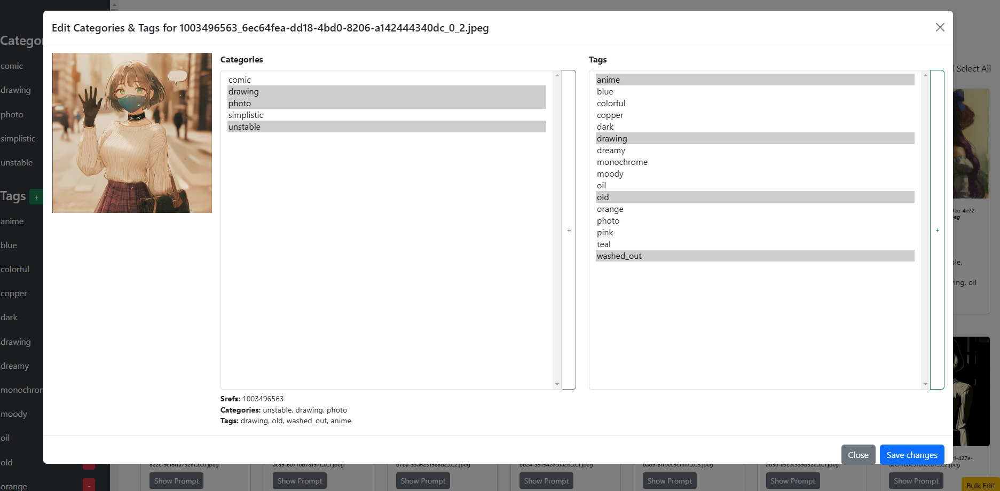
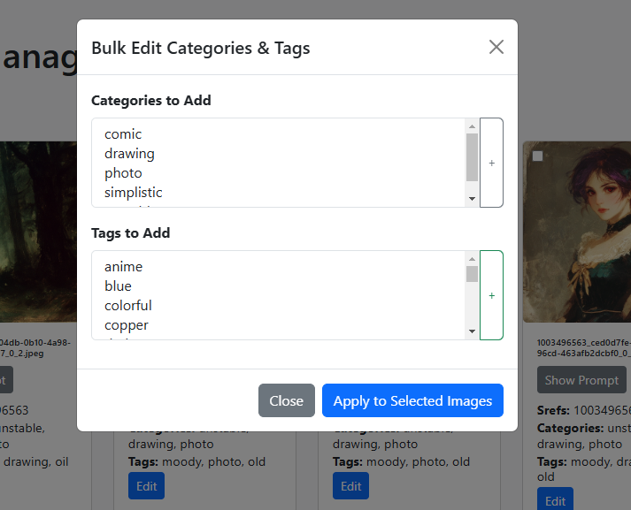

## Midjourney sref Gallery

This is the static Midjourney sref gallery. All post information is stored in `data.js`. 

Here's how it looks:

You can preview posts and images, with each image having a unique URL:

There’s also a search function allowing users to search within titles, prompts, srefs, categories, and tags:

Regarding categories, you can filter posts by one or multiple categories:

## Data Preparation

Now, about the workflow. While you could manually save images and edit `data.js` JSON by hand, this process can be very tedious.

Here’s the approach I use. First, you need to save information about each image generation. For this, I created a [userscript](misc/tampermonkey_mj_downloader.js "userscript") for Tampermonkey that saves both the image and its individual JSON data (use Ctrl + ; or Ctrl + /).

After that, use an auxiliary [tagger web application](misc/category_and_tags) (Python Flask-based):

You can add tags or categories to the main lists from the main window. Additionally, when editing a specific image, you can select from existing tags and categories, or add new ones on the spot:

You can also bulk add categories or tags to multiple images at once:

